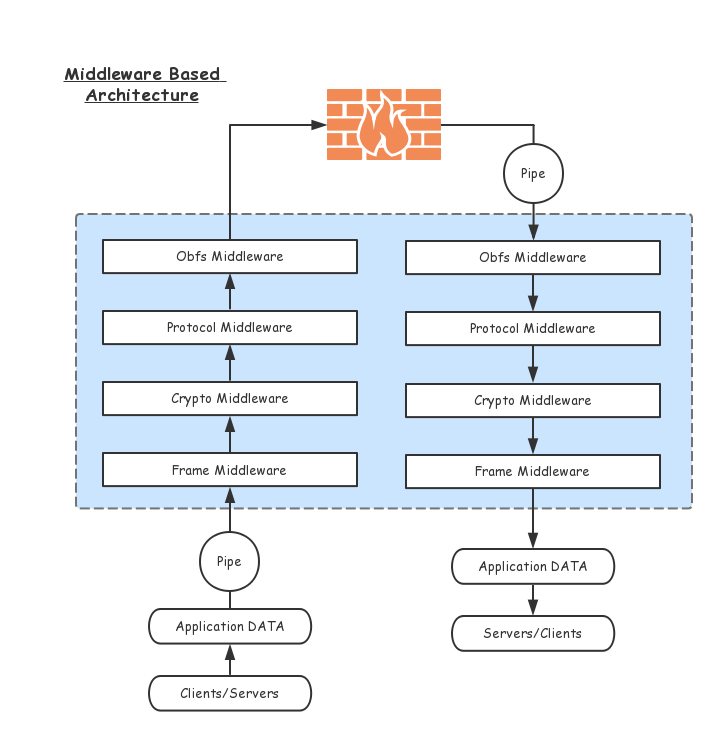

# Architecture



## Proxy Protocols

To take over data send and receive of applications, we must find a widely
used proxy protocol. Http/Socks5/Socks4/Socks4a are ideal, they only work
on the client side, so don't worry about being attacked.

## Pipe

## Middleware

Middleware is a class which used for processing input data to output data from/to
different middlewares. There are four kind of middlewares:

* FrameMiddleware

The lowest layer in the middleware stack. It packs data from application,
or unpacks data from CryptoMiddleware.

* CryptoMiddleware

The second layer in the middleware stack. It encrypts data from FrameMiddleware,
or decrypts data from ProtocolMiddleware.

* ProtocolMiddleware

The third layer in the middleware stack. It encapsulates data with additional
headers from CryptoMiddleware, or decapsulates data from ObfsMiddleware.

The additional headers may be used for AEAD or other needs.

* ObfsMiddleware

The last layer in the middleware stack. It encapsulates data with obfuscation
headers from ProtocolMiddleware, or decapsulates data from network.

## Preset

Preset is the **implement** of middleware, a typical preset must implement
four methods of IPreset interface, for examples you can check out `src/presets`,
there are several built-in presets already.

```
export class CustomPreset extends IPreset {

  clientOut(/* {buffer, next, broadcast} */) {

  }

  serverIn(/* {buffer, next, broadcast} */) {

  }

  serverOut(/* {buffer, next, broadcast} */) {

  }

  clientIn(/* {buffer, next, broadcast} */) {

  }

}
```

|  METHODS  |              DESCRIPTION             |
|:----------|:-------------------------------------|
| clientOut | client will send data to server      |
| serverIn  | server received data from client     |
| serverOut | server will send back data to client |
| clientIn  | client received data from server     |

NOTE: `server*` are used on the server side while `client*` are used on the client side.

## DNS Cache

Blinksocks use `dns.lookup` which uses operating system facility to resolve 
a hostname to an ip, then cache it in memory for a period of time. Aimed at 
speeding up the transition process.
